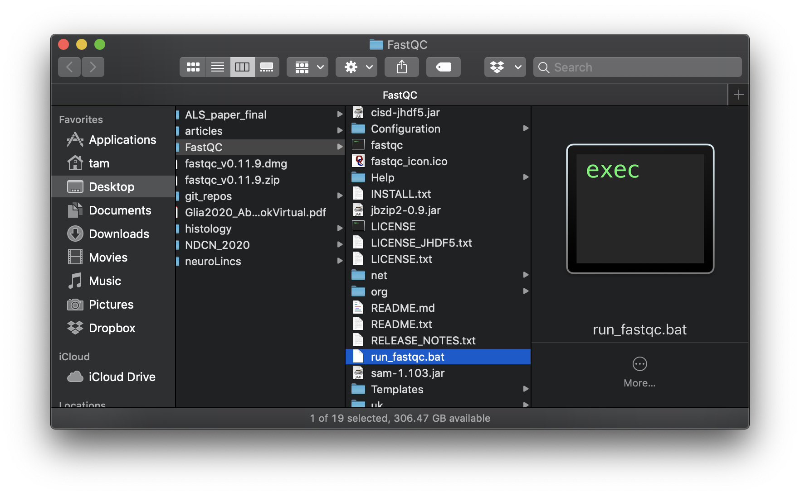
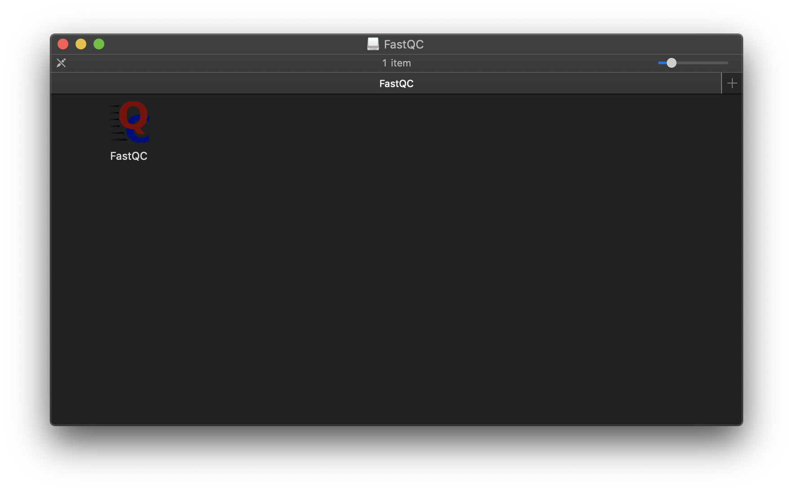

## FastQC

From [FastQC
website](https://www.bioinformatics.babraham.ac.uk/projects/fastqc/):
"FastQC aims to provide a simple way to do some quality control checks
on raw sequence data coming from high throughput sequencing
pipelines. It provides a modular set of analyses which you can use to
give a quick impression of whether your data has any problems of which
you should be aware before doing any further analysis. "

This is a useful program that performs some of the basic diagnostics
on a FASTQ sequence file, looking for common issues that could appear
in your libraries.

First we would download the FastQC program:

If you are using a PC or Linux, you can download it
  [here](https://www.bioinformatics.babraham.ac.uk/projects/fastqc/fastqc_v0.11.9.zip)
* Unzip the file, and open the FastQC folder
* Doubleclick on run_fastqc.bat

If you are using a Mac, you can download it [here](https://www.bioinformatics.babraham.ac.uk/projects/fastqc/fastqc_v0.11.9.dmg)
* Doubleclick on the downloaded DMG file to open it
* Doubleclick on the FastQC app
  * The first time that you are opening this, you may need to hold
  down the "control" key, right-click on the FastQC app, and click "Open"

### FastQC analysis modules

1. [Basic
   statistics](https://www.bioinformatics.babraham.ac.uk/projects/fastqc/Help/3%20Analysis%20Modules/1%20Basic%20Statistics.html)
2. [Per base sequence
   quality](https://www.bioinformatics.babraham.ac.uk/projects/fastqc/Help/3%20Analysis%20Modules/2%20Per%20Base%20Sequence%20Quality.html)
3. [Per sequence quality
   scores](https://www.bioinformatics.babraham.ac.uk/projects/fastqc/Help/3%20Analysis%20Modules/3%20Per%20Sequence%20Quality%20Scores.html)
4. [Per base sequence
   content](https://www.bioinformatics.babraham.ac.uk/projects/fastqc/Help/3%20Analysis%20Modules/4%20Per%20Base%20Sequence%20Content.html)
5. [Per sequence GC
   content](https://www.bioinformatics.babraham.ac.uk/projects/fastqc/Help/3%20Analysis%20Modules/5%20Per%20Sequence%20GC%20Content.html)
6. [Per base N
   content](https://www.bioinformatics.babraham.ac.uk/projects/fastqc/Help/3%20Analysis%20Modules/6%20Per%20Base%20N%20Content.html)
7. [Sequence length
   distribution](https://www.bioinformatics.babraham.ac.uk/projects/fastqc/Help/3%20Analysis%20Modules/7%20Sequence%20Length%20Distribution.html)
8. [Duplicate
   sequences](https://www.bioinformatics.babraham.ac.uk/projects/fastqc/Help/3%20Analysis%20Modules/8%20Duplicate%20Sequences.html)
9. [Overrepresented
   sequences](https://www.bioinformatics.babraham.ac.uk/projects/fastqc/Help/3%20Analysis%20Modules/9%20Overrepresented%20Sequences.html)
10. [Adapter
    content](https://www.bioinformatics.babraham.ac.uk/projects/fastqc/Help/3%20Analysis%20Modules/10%20Adapter%20Content.html)
11. [Kmer
    content](https://www.bioinformatics.babraham.ac.uk/projects/fastqc/Help/3%20Analysis%20Modules/11%20Kmer%20Content.html)
12. [Per tile sequence
    quality](https://www.bioinformatics.babraham.ac.uk/projects/fastqc/Help/3%20Analysis%20Modules/12%20Per%20Tile%20Sequence%20Quality.html)
